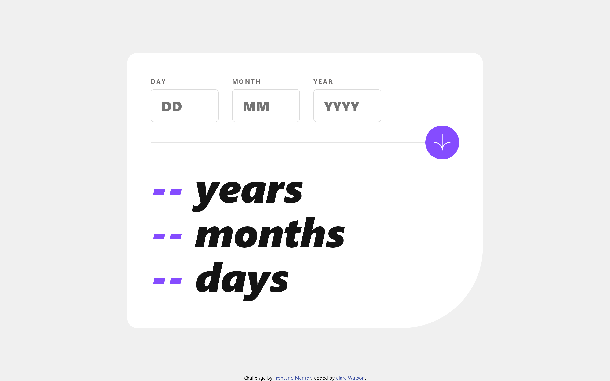

# Frontend Mentor - Age calculator app solution

This is a solution to the [Age calculator app challenge on Frontend Mentor](https://www.frontendmentor.io/challenges/age-calculator-app-dF9DFFpj-Q). Frontend Mentor challenges help you improve your coding skills by building realistic projects.

## Table of contents

- [Overview](#overview)
  - [The challenge](#the-challenge)
  - [Screenshot](#screenshot)
  - [Links](#links)
- [My process](#my-process)
  - [Built with](#built-with)
  - [What I learned](#what-i-learned)
  - [Useful resources](#useful-resources)
- [Author](#author)

## Overview

### The challenge

Users should be able to:

- View an age in years, months, and days after submitting a valid date through the form
- Receive validation errors if:
  - Any field is empty when the form is submitted
  - The day number is not between 1-31
  - The month number is not between 1-12
  - The year is in the future
  - The date is invalid e.g. 31/04/1991 (there are 30 days in April)
- View the optimal layout for the interface depending on their device's screen size
- See hover and focus states for all interactive elements on the page
- **Bonus**: See the age numbers animate to their final number when the form is submitted

### Screenshot

### Links

- Solution URL: [https://github.com/cwatso/age-calculator](https://github.com/cwatso/age-calculator)
- Live Site URL: [https://cwatso.github.io/age-calculator](https://cwatso.github.io/age-calculator)

## My process

### Built with

- Vite
- Semantic HTML5 markup
- CSS custom properties
- SCSS
- Flexbox
- Javascript

### What I learned

Calculating days, months, and years between two dates is one of those tasks that appears deceptively simple at first glance, but is in practice something that takes some consideration to do accurately. Initially I approached this by subtracting a date object of the birth date from the current date and dividing to create years, months and days, however this was not very precise. The fact that different months contain different amounts of days and the existence of leap years are two complicating factors. After some research I stumbled upon a blog post by Kevin Leary (link below) which gave a great description of how to do this to a much better degree of accuracy. The resulting code now accounts for the variation of days and leap years.

### Useful resources

- [Javascript Precises Age from Birthdate - Kevin Leary](https://www.kevinleary.net/blog/javascript-age-birthdate-mm-dd-yyyy/) - This blog post gave a great explanation of the issues with calculating age in years months and days and provided a good solution for handling these issues.
- [A simple count-up number animation with Javascript - James Shakespeare](https://jshakespeare.com/simple-count-up-number-animation-javascript-react/) - Served as inspiration for how to animate the numbers. I updated the solution described to use animation frames to improve performance.

## Author

- Website - [Clare Watson](https://www.clarewatson.com)
- Frontend Mentor - [@cwatso](https://www.frontendmentor.io/profile/cwatso)
